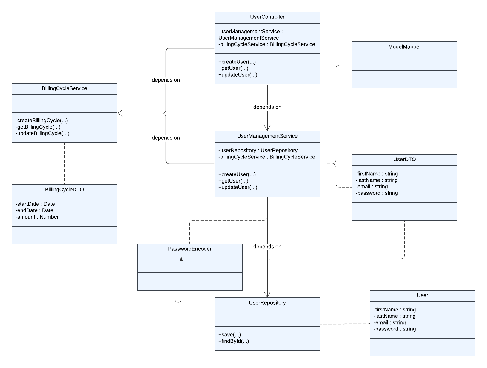

# User Management Service

## Overview

The `UserManagementService` is a service that manages the users.

## API Endpoints

### `POST /api/users`

Creates a new user.

**Request:**

```json
{
  "firstName": "<first_name>",
  "lastName": "<last_name>",
  "email": "<email>",
  "password": "<password>"
}
```

**Response:**

```json
{
  "id": "<user_id>",
  "firstName": "<first_name>",
  "lastName": "<last_name>",
  "email": "<email>"
}
```

### `GET /api/users/{id}`

Retrieves a user by ID.

**Response**

```json
{
  "id": "<user_id>",
  "firstName": "<first_name>",
  "lastName": "<last_name>",
  "email": "<email>"
}
```

### `PUT /api/users/{id}`

Updates a user by ID.

**Request:**

```json
{
  "firstName": "<first_name>",
  "lastName": "<last_name>",
  "email": "<email>"
}
```

**Response**

```json
{
  "id": "<user_id>",
  "firstName": "<first_name>",
  "lastName": "<last_name>",
  "email": "<email>"
}
```

## Error Handling
for the error handling, I used the `@ControllerAdvice` annotation to define a global exception handler. This class contains methods annotated with `@ExceptionHandler` that handle specific exceptions and return an appropriate response.
```json
{
   "status": 404,
   "message": "User not found"
}
```
## Exceptions
**UserAlreadyExistsException**

This exception is thrown when a user already exists with the provided email.  

**UserNotFoundException**

This exception is thrown when no user exists with the provided user ID.

## Database Schema
The service uses MongoDB as its database. The main collection used by this service is `User`.

**Collection: User**
- `_id`: The unique identifier for the document. It is a string.
  - `firstName`: The first name of the user. It is a string.
  - `lastName`: The last name of the user. It is a string.
  - `email`: The email address of the user. It is a string.
  - `password`: The password of the user. It is a string.
  - `createdAt`: The timestamp when the user was created. It is a date.
  - `updatedAt`: The timestamp when the user was last updated. It is a date.
  - `deletedAt`: The timestamp when the user was deleted. It is a date.
  
## Dependencies
- `UserRepository`: Used for database operations related to users (e.g., finding users by ID, email, or mobile number, inserting or updating users).
- `PasswordEncoder`: Used for encoding and decoding passwords.
- `ModelMapper`: Used for mapping entities to DTOs and vice versa.

## External Service Calls

### Billing Cycle Management

The `UserManagementService` interacts with an external service called `BillingCycleService` to manage the user's billing cycle. This interaction happens when a new user is created.

When a new user is created, the `UserManagementService` calls the `BillingCycleService` to create a new billing cycle for the user. This is done asynchronously to not block the user creation process. The `BillingCycleService` makes a POST request to an external API with the user's ID and phone number in the request body.


